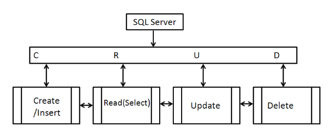

# MongoDB | CRUD functionality & connecting to external database 

This app covers an introduction to CRUD operations (Create, Read, Update & Delete) functionality and how to connect an app to an external Mongo database.

Prerequisite installations:

- MongoDB
- Python3
- PyMongo 

For this app, x2 data models were created:

- `mongo.py` - test the connection with MongoDB. Queries can be either added into htis file or run from the mongo shell to test for a successful connection to the external databsse
    - Set environment variable
    - add database name
    - add collection name

- `mongo_project.py` - In addition to the code created in `mongo.py` file, the following functions were created to execute CRUD operations;
    - `show_menu` - user menu set out in numerical form
    - `get_record` - locate record from database using pre-defined search parameters
    - `add_record` - all available data fields set and user able to input their data
    - `find_record` - locate record function created that is derived from the `get_record` function
    - `edit_record` - user able to locate existing record with choice to either update or leave
    - `delete_record` - user to locate an existing record and choice set to delete or leave
    - `main_loop` - Loop ensures the user is returned to the main menu upon completion of a CRUD operation

***

